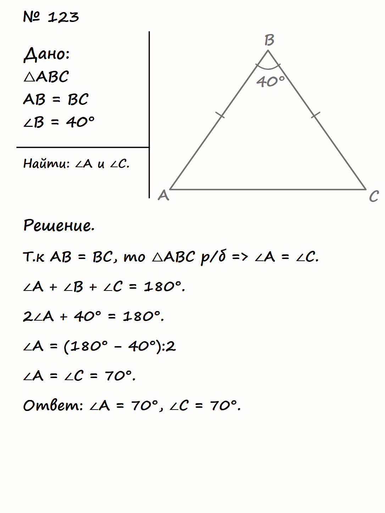

# Geometry Notebook Layout V1

`geometry-notebook-layout-v1.png` is the approved visual source of truth for the geometry notebook. If an older implementation or instruction disagrees with this image, the image wins.

## Renderer contract

`GeometryNotebookLayoutV1` owns the logical `1086 × 1448` SVG page and all of its coordinates. Geometry problem data supplies only the task number, the Given and Find/Prove content, a semantic diagram, solution lines, and an answer. It cannot set CSS, JSX, page zones, fonts, colours, grid dimensions, dividers, or absolute page coordinates.

The page is proportionally scaled as one canvas on narrow screens; its contents never reflow. Solution text that does not fit is continued on a second sheet with the same notebook settings.

## Fixed properties

- plain white paper;
- black handwritten ink using the approved `Segoe Print` stack;
- task number in the upper-left work area;
- Given at upper left; a horizontal divider touching the vertical divider with no gap;
- Find/Prove below the horizontal divider, with the diagram to the right of the vertical divider;
- exactly one angle arc at B for the approved isosceles fixture;
- left-aligned solution and answer beneath the header block.

All layout constants live in `src/notebook/layouts/geometryNotebookLayoutV1.ts`. Its invariants are covered by unit tests. The approved fixture and screenshots are covered by Playwright in `tests/geometry-notebook.visual.spec.ts` at 390×844, 430×932, and the logical canvas size.

Run visual checks with `npm run test:visual`. Snapshot updates must be an explicit, reviewed design decision; `--update-snapshots` is never part of regular test commands.
